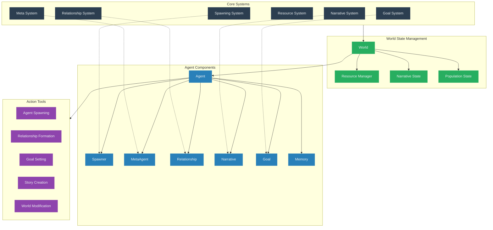
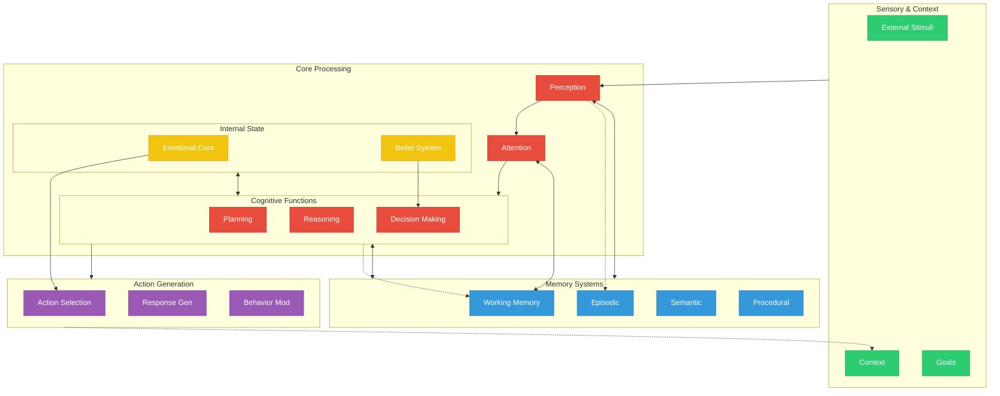

# Self-Organizing Narrative Agent System (SONAS)

## Overview

SONAS is an emergent narrative ecosystem built on a Entity Component System (ECS) architecture, enabling dynamic agent creation, self-regulation, and collaborative storytelling. The system allows for autonomous agent spawning, relationship formation, and coherent narrative development through distributed yet coordinated agent actions.

## Core Architecture



## Agent Cognitive Architecture



## System Components

### 1. Core Components

- **Spawner**: Controls agent creation capabilities

  - Spawn permissions
  - Resource requirements
  - Template management
  - Lifecycle hooks

- **MetaAgent**: System oversight and regulation

  - Health monitoring
  - Resource utilization
  - Performance metrics
  - System adjustment

- **Relationship**: Inter-agent connections

  - Relationship types
  - Connection strength
  - Interaction history
  - Influence metrics

- **Narrative**: Story tracking

  - Plot points
  - Character arcs
  - Themes
  - Story state

- **Goal**: Shared objectives
  - Goal hierarchy
  - Progress tracking
  - Priority levels
  - Success criteria

### 2. Core Systems

#### SpawningSystem

- Agent creation/destruction management
- Resource allocation
- Population control
- Template instantiation

#### NarrativeSystem

- Story coherence maintenance
- Plot development
- Character arc tracking
- Theme management

#### RelationshipSystem

- Connection formation/dissolution
- Interaction management
- Network effects
- Influence propagation

#### ResourceSystem

- Compute allocation
- Memory management
- Performance optimization
- Resource distribution

#### GoalAlignmentSystem

- Objective coordination
- Progress tracking
- Priority management
- Conflict resolution

#### MetaSystem

- System health monitoring
- Performance optimization
- Emergency interventions
- System adaptation

## Memory Architecture

### Hierarchical Structure

1. Individual Memory

   - Personal experiences
   - Action history
   - Relationship data
   - Goal progress

2. Shared Memory

   - Collective experiences
   - Common knowledge
   - Shared goals
   - Group narratives

3. System Memory
   - Global state
   - Resource allocation
   - Population metrics
   - Performance data

## Implementation Tasks

### Phase 1: Foundation

- [ ] Implement enhanced Agent Factory
- [ ] Create core new components (Spawner, MetaAgent, etc.)
- [ ] Develop basic memory hierarchy
- [ ] Set up resource tracking system

### Phase 2: Core Systems

- [ ] Implement SpawningSystem
- [ ] Develop NarrativeSystem
- [ ] Create RelationshipSystem
- [ ] Build ResourceSystem
- [ ] Implement GoalAlignmentSystem
- [ ] Develop MetaSystem

### Phase 3: Actions & Tools

- [ ] Create agent spawning actions
- [ ] Implement relationship formation tools
- [ ] Develop goal management tools
- [ ] Build narrative creation tools
- [ ] Implement world state modification tools

### Phase 4: Coordination

- [ ] Develop message passing system
- [ ] Implement consensus mechanisms
- [ ] Create resource negotiation
- [ ] Build priority resolution system
- [ ] Implement narrative conflict resolution

### Phase 5: Testing & Optimization

- [ ] Develop performance metrics
- [ ] Create system health monitoring
- [ ] Implement stress testing
- [ ] Optimize resource usage
- [ ] Fine-tune narrative coherence

## Technical Considerations

### Performance

- Efficient ECS implementation
- Optimized memory management
- Scalable agent population
- Resource-aware spawning

### Stability

- Error handling
- System recovery
- State persistence
- Backup mechanisms

### Extensibility

- Plugin architecture
- Custom components
- Action tool expansion
- System hooks

## Future Enhancements

### Advanced Features

- Multi-narrative threading
- Dynamic world generation
- Emotional simulation
- Learning from interactions
- Advanced story patterns

### Integration Possibilities

- External AI services
- Content generation tools
- User interfaces
- Analytics systems
- Export capabilities

## Success Metrics

### System Health

- Resource utilization
- Response times
- Error rates
- Population stability

### Narrative Quality

- Story coherence
- Character development
- Plot progression
- Theme consistency

### Agent Performance

- Goal completion
- Relationship quality
- Spawn success rate
- Action effectiveness

````mermaid
graph TD
    subgraph "Meta-Engine Layer"
        Dev[Developer Agents] --> Engine[Engine Evolution]
        Dev --> Components[Component Creation]
        Dev --> Actions[Action Development]
        Dev --> Systems[System Enhancement]
    end

    subgraph "Production Studio"
        Director[Director Agents] --> Story[Story Development]
        Writer[Writer Agents] --> Content[Content Creation]
        Designer[Designer Agents] --> Assets[Asset Generation]
        Tech[Technical Agents] --> Platform[Platform Integration]
    end

    subgraph "Reality Layer"
        Actor[Actor Agents] --> Social[Social Media]
        NPC[NPC Agents] --> World[World Interaction]
        Support[Support Agents] --> Engagement[User Engagement]
    end
    ```
````
