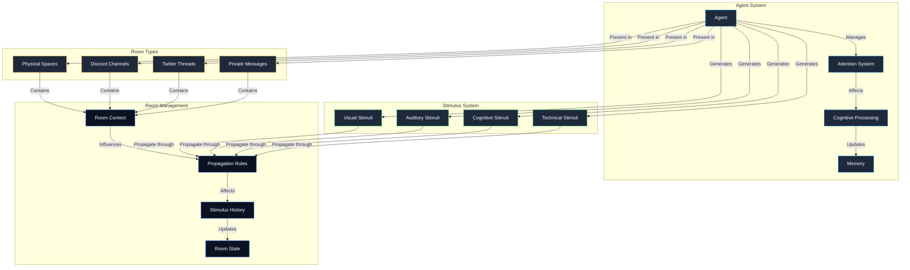

# Agent Cognition Architecture

## System Overview

The Agent Cognition Architecture is a unified system for modeling intelligent agent interactions across both simulated and real-world communication spaces. At its core, it treats all interaction spaces as "rooms" - whether they're physical locations, Discord channels, Twitter threads, or private conversations. This unified approach allows us to model complex multi-agent interactions while maintaining a consistent mental model for how information flows and how agents process their environment.

### Key System Principles

1. **Universal Room Abstraction**
   The system's fundamental innovation is treating all interaction spaces as rooms. This abstraction unifies how we handle different types of agent communication, from simulated physical spaces to social media platforms. Each room maintains its own context, history, and rules for how information propagates. This approach allows us to model everything from a private conversation between two agents to a bustling Twitter thread with hundreds of participants using the same core mechanics.

2. **Natural Attention Management**
   Agents in the system manage their attention similar to how humans do, but with configurable capabilities. They can be present in multiple rooms simultaneously but must manage their attention across these spaces. This creates natural limitations and forces prioritization, leading to more realistic and interesting agent behaviors. The attention system can be scaled from human-like (focused on one thing at a time) to more distributed (handling multiple streams concurrently).

3. **Stimulus-Based Communication**
   All interactions in the system are modeled as stimuli. When an agent speaks, moves, or takes any action, they generate stimuli that propagate through their current room(s). Other agents process these stimuli based on their attention level and current cognitive load. This creates a rich, dynamic environment where information naturally flows and decays over time.

4. **Platform-Agnostic Design**
   While the system can integrate with real platforms like Discord and Twitter, it maintains a platform-agnostic core. All platform-specific features are mapped to the universal room model, making it easy to add support for new platforms or create custom interaction spaces. This design allows agents to move seamlessly between different types of spaces while maintaining consistent behavior patterns.

### System Flow

1. **Room Creation and Management**

   - Rooms are created as needed for different interaction contexts
   - Each room maintains its own state, including present agents and active stimuli
   - Rooms can be nested (like threads in a channel) or linked (like quoted tweets)
   - Room properties determine how information flows and decays

2. **Agent Presence and Attention**

   - Agents can be present in multiple rooms
   - Each presence has an associated attention level
   - Attention is managed as a limited resource
   - Higher attention levels allow for more immediate and detailed stimulus processing

3. **Information Flow**

   - Agents generate stimuli through their actions
   - Stimuli propagate through rooms based on room rules
   - Other agents process stimuli based on their attention level
   - Information naturally decays over time
   - Critical information can trigger attention shifts

4. **Social Dynamics**
   - Relationships form through repeated interactions
   - Group dynamics emerge naturally from room interactions
   - Social contexts influence agent behavior
   - Attention patterns affect relationship development

### Cross-Room Cognitive Model

The system implements a unified cognitive model where agents maintain global awareness and memory across all rooms they inhabit. This creates a more realistic and sophisticated agent that can leverage experiences and relationships across different contexts.

1. **Unified Memory System**

   - Single, global memory store across all rooms
   - Memories tagged with room context but globally accessible
   - Experiences in one room can inform decisions in others
   - Relationship information persists across all interactions

2. **Multi-Room Stimulus Processing**

   - Simultaneous stimulus reception from all present rooms
   - Attention-weighted processing priority
   - Cross-room context awareness
   - Ability to recognize patterns across different spaces

3. **Global Thought Stream**

   - Single thought stream incorporating all room contexts
   - Decision making informed by total environmental awareness
   - Ability to connect information between rooms
   - Context-aware response generation

4. **Relationship Building**

   - Relationships develop from interactions across all rooms
   - Social graph maintains global connection strength
   - Trust and familiarity persist across contexts
   - Cross-room interaction history

5. **Attention Management**
   - Configurable attention distribution across rooms
   - Dynamic priority adjustment based on activity
   - Interrupt system for critical events
   - Background monitoring of low-priority rooms

This architecture provides a flexible foundation for modeling complex agent interactions while maintaining realistic limitations and behaviors. It can scale from simple simulations to complex multi-platform agent networks while keeping a consistent underlying model.

### System Architecture Diagram

## Core Concepts

### Rooms as Universal Interaction Spaces

Rooms serve as the fundamental unit of interaction space in the system. Rather than having different models for different types of communication, rooms provide a unified abstraction that can represent any type of interaction space.

#### Room Properties

- **Context**: Each room maintains its own semantic context and atmosphere
- **Stimulus History**: Track and maintain relevant stimuli and interactions
- **Visibility Levels**: Public, private, or invite-only access
- **Persistence**: Ephemeral to permanent
- **Attention Cost**: Required cognitive load for participation

#### Room Types

1. **Physical/Simulation Rooms**

   - Represent spatial locations
   - Support physical presence and movement
   - Model environmental stimuli

2. **Communication Platforms**

   - **Discord**

     - Channels → Persistent rooms
     - Threads → Time-bounded sub-rooms
     - DMs → Private 2-person rooms
     - Group DMs → Private multi-person rooms

   - **X/Twitter**
     - Threads → Public branching rooms
     - Quote Tweets → Linked/nested rooms
     - DMs → Private rooms

3. **Room Mechanics**
   - Nesting (threads within channels)
   - Linking (cross-posts, quotes)
   - Custom stimulus propagation rules
   - Variable information decay rates
   - Platform-specific interaction rules

### Agent Cognition Model

#### Attention System

1. **Presence Levels**

   - Active Participant (high attention)
   - Observer (low attention)
   - Lurker (minimal attention)
   - Mentioned/Tagged (notification-only)

2. **Attention Management**

   - Primary focus gets most resources
   - Background monitoring for other rooms
   - Interrupt system for critical notifications
   - Attention capacity can be configured

3. **Cognitive Load**
   - Different activities require different attention levels
   - Active conversation: High load
   - Passive monitoring: Low load
   - Processing complex stimuli: Variable load

#### Stimulus Processing

1. **Types**

   - Visual
   - Auditory
   - Cognitive
   - Technical
   - Environmental

2. **Processing Rules**
   - Immediate vs Background processing
   - Priority-based handling
   - Context-aware interpretation
   - Memory integration

### Communication Model

#### Stimulus Flow

1. **Generation**

   - Agents generate stimuli based on internal state
   - Stimuli are emitted into rooms
   - Different types have different propagation rules

2. **Reception**

   - Agents receive stimuli based on presence level
   - Processing priority based on attention system
   - Integration with existing knowledge/context

3. **Decay**
   - Information degrades over time
   - Different decay rates for different stimulus types
   - Room-specific decay rules

#### Social Dynamics

1. **Relationships**

   - Form through repeated interactions
   - Influenced by interaction quality
   - Affect future interaction likelihood

2. **Group Dynamics**
   - Emerge from room interactions
   - Influence agent behavior
   - Create social contexts

## Implementation Considerations

### Visualization

1. **Network Graph**

   - Rooms as hub nodes
   - Agents cluster around active rooms
   - Edge weights show attention levels
   - Activity levels affect node appearance
   - Stimulus flow shown through animations

2. **Room Hierarchy**
   - Nested visualization for sub-rooms
   - Clear visual distinction between room types
   - Dynamic reorganization based on activity

### Scalability

1. **Attention Management**

   - Efficient resource allocation
   - Graceful degradation under load
   - Priority-based processing

2. **Room Management**
   - Efficient room creation/destruction
   - Smart caching of room state
   - Optimized stimulus propagation

### Platform Integration

1. **API Considerations**

   - Platform-specific rate limits
   - Authentication management
   - Event handling

2. **Data Mapping**
   - Platform concepts → Room model
   - Platform events → Stimuli
   - Platform interactions → Agent actions

## Future Extensions

### Potential Enhancements

1. **Advanced Cognition**

   - Multiple attention models
   - Learning from interactions
   - Adaptive behavior

2. **Platform Support**

   - Additional social platforms
   - Custom interaction spaces
   - Virtual environments

3. **Analysis Tools**
   - Interaction pattern analysis
   - Social network analysis
   - Cognitive load monitoring
